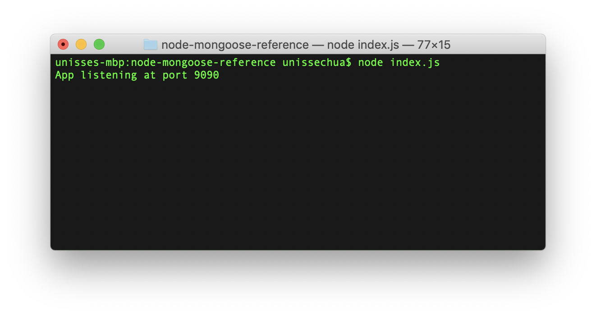
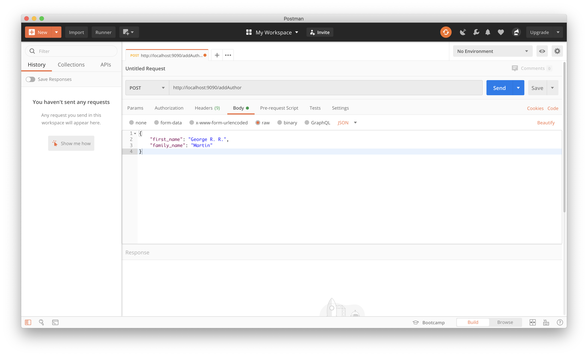
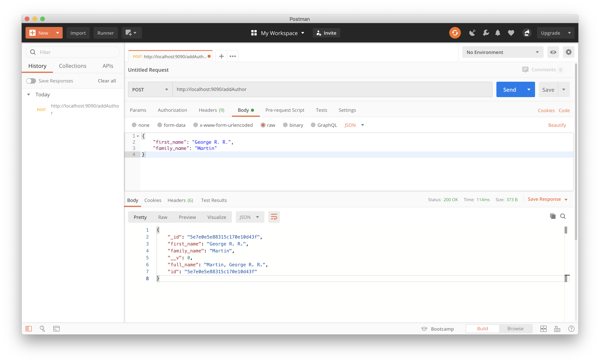
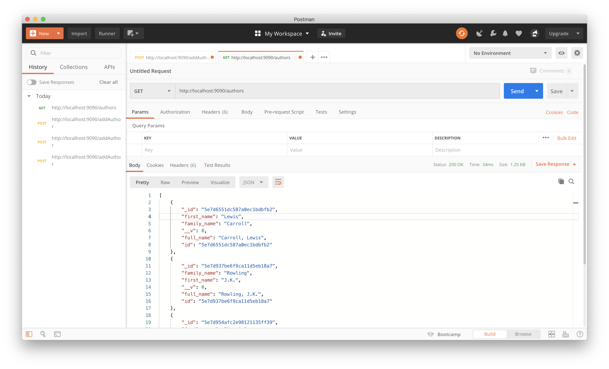
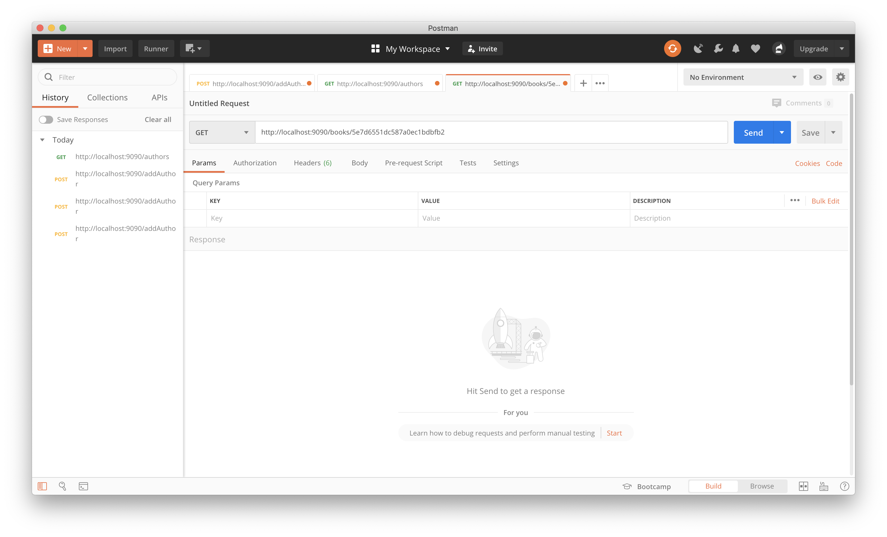

# Referencing in MongoDB with Mongoose and Node.js

A purely backend server that illustrates how to define mongoose Schema/Model with referencing to represent relationships between MongoDB collections. To be able to test the endpoints, make sure to have [Postman](https://www.postman.com/) installed.

This repository is an extension of the lecture on **Referencing and More in Mongo(db/oose)**. The models here are based on the [MDN Tutorial on mongoose](https://developer.mozilla.org/en-US/docs/Learn/Server-side/Express_Nodejs/mongoose).

## Requirements
* [NodeJS & npm](https://www.npmjs.com/get-npm)
* [MongoDB Community Edition](https://docs.mongodb.com/manual/administration/install-community/) (Must be running in the background)
* [Postman](https://www.postman.com/) - To be able to test the endpoints
* Any text editor for JavaScript, HTML & CSS (VSCode, Atom, SublimeText, etc.)

## Local Setup
1. Clone this repository: `git clone https://github.com/unisse-courses/node-mongoose-reference.git`
2. Navigate to the directory: `cd node-mongoose-reference`
3. Install the dependencies: `npm install`
   - I've already installed mongoose so it's in the `package.json` file already.
4. Run the server: `node index.js`
   - It should simply be listening on port 9090. There's nothing to open in the browser for this sample.

## What's Inside
Side Note: _This is a mini reference to the [musical Waitress (Spotify album of Sara Bareilles~)](https://open.spotify.com/album/1s6codM2ZAB008t9GTyaEk)!_

#### 1. [data](data) folder
This folder contains 3 `json` files for the data to be inserted into the database.

#### 2. [models](models) folder
This folder contains the `mongoose.Schema` definition of the collections to be used in this example (based on the [MDN Tutorial on mongoose](https://developer.mozilla.org/en-US/docs/Learn/Server-side/Express_Nodejs/mongoose)).

#### 3. [index.js](index.js)
All the API endpoints definition are here.
* `/addAuthor` — Adds an author into the database
* `/addGenre` — Adds a genre into the database
* `/addBook` — Adds a book into the database. Author name and genres should also be provided
* `/authors` — Returns all authors
* `/genres` — Returns all genres
* `/books` — Returns all books with authors and genres populated
* `/books/:authorid` — Returns all books given the authorid

## How to Test the Endpoints
1. Make sure that the server is running by executing `node index.js` in the console.


2. Open up the [Postman](https://www.postman.com/) application to get started.

### POST endpoints
1. On [Postman](https://www.postman.com/), set up the request to a **POST** request on using the dropdown select beside the text box for the request URL. Type in the URL below and click on the "Headers" tab right below it to set the `Content-Type` header. _(Don't click send yet, we still have to set the request body!)_
  ```
  URL: http://localhost:9090/addAuthor
  Request Headers:
    Content-Type: application/json
  ```
  

  Replace the URL with the enpoint you'd like to use. Or you can create multiple tabs for each `/add` endpoint.

2. Open the corresponding `json` file under the [`data`](data) folder. (i.e. [`data/authors.json`](data/authors.json)). The data is an array of Objects for each file but the endpoints only accept **one** Object at a time.

  Copy one item from the `json` file and paste it in the Body tab of the POST request.
  ```json
  {
    "first_name": "George R. R.",
    "family_name": "Martin"
  }
  ```

  

3. Click **Send** and the result should show the inserted document.

  

4. Repeat steps 2 & 3 for all the objects in [`data/authors.json`](data/authors.json) and [`data/genres.json`](data/genres.json) to populate the two collections.

5. Start inserting books from [`data/books.json`](data/books.json). Read the inline comments in [`index.js`](index.js) to understand the entire process of inserting a book with references to the **author** and **genres**.

### GET "All" endpoints
1. On [Postman](https://www.postman.com/), set up the request to a **GET** request on using the dropdown select beside the text box for the request URL.
  ```
  URL: http://localhost:9090/authors
  ```
  Unlike the **`POST`** request earlier, there's no request body or parameters for this since we're retrieving all the values in the collection. Since there's no body, we don't need to set the request header too.

2. Click **Send** and the result should show all the documents in the collection.

  

3. Test out `http://localhost:9090/genres` and `http://localhost:9090/books` too!

### GET `/books/:authorid`
1. On [Postman](https://www.postman.com/), set up the request to a **GET** request on using the dropdown select beside the text box for the request URL.
  ```
  URL: http://localhost:9090/books/:authorid
  ```
  The **`:authorid`** needs to be replaced with an actual `_id` value from the authors collection.

  

2. Click **Send** and the result should show all the books by the selected author only.

  

---

## Challenges
These are some tasks to help you practice creating your own server endpoints to handle client requests for data.

If you'd like to get feedback, fork this repository and commit the additions you make. Send the link to the forked repository to me whenever it's done.

1. Create a GET `/books/genre/:genreid` that will retrieve all the books given the `_id` of the genre.
2. Modify the POST `/addBook` to insert the author if not found.
3. Create GET endpoints for the following:
    * `/authors/:id` — Returns the author given the id
    * `/genre/:id` — Returns the genre given the id
